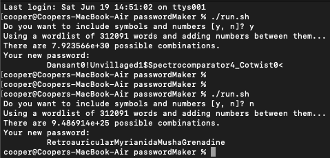

# Password Generator
A simple tool to make passwords.  
Intended for use on my MacBook Air.  
Anyone can use it, just substitute the dictionaries you want to use.  



## Purpose/Goal
To have an electronic version of my resume easily accessible that has a similar format to my paper version but with working links.

## Operation
Run options:
```bash
./run.sh
./run.sh /usr/share/dict/web2 /usr/share/dict/web2a


# Choose "y" to add numbers and symbols to the password.
```

## Tech/Libraries Used
* Python

## Problems/Solutions
* Thinking of a password became really annoying so I made this program to do it for me.
* Completely random text resembling hashes are too hard to remember, so I chose to use words.
* It's common that password requirements include symbols and numbers, so I added an option for those.

## More Information
